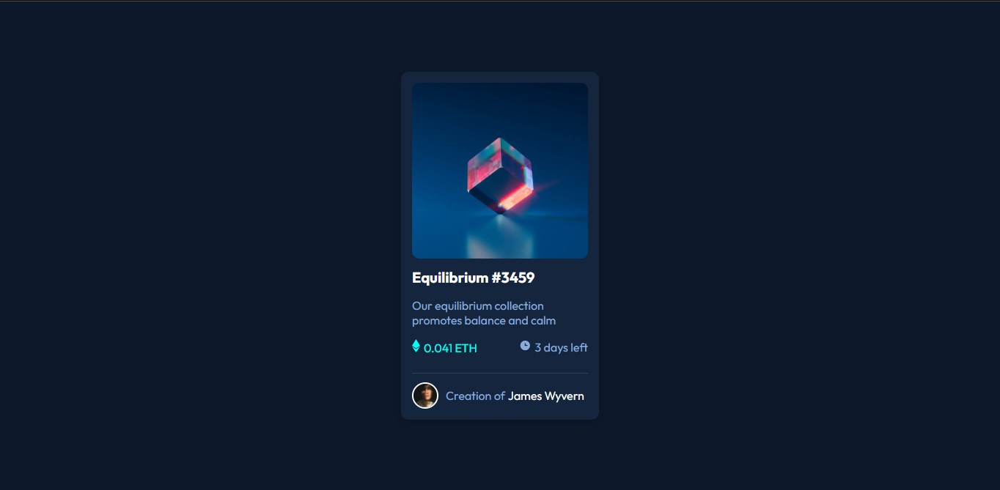

# Frontend Mentor - NFT preview card component solution

This is a solution to the [NFT preview card component challenge on Frontend Mentor](https://www.frontendmentor.io/challenges/nft-preview-card-component-SbdUL_w0U). 

## Table of contents

- [Overview](#overview)
  - [The challenge](#the-challenge)
  - [Screenshot](#screenshot)
  - [Links](#links)
- [My process](#my-process)
  - [Built with](#built-with)
  - [What I learned](#what-i-learned)
  - [Continued development](#continued-development)
- [Author](#author)

## Overview

### The challenge

Users should be able to:

- View the optimal layout depending on their device's screen size
- See hover states for interactive elements

### Screenshot



### Links

- Solution URL: [https://github.com/himelriyad02/nft-preview-frontend]
- Live Site URL: [https://himelriyad02.github.io/nft-preview-frontend/]
- Interesting trick: [https://www.w3schools.com/howto/howto_css_image_overlay.asp]

## My process

### Built with

- Semantic HTML5 markup
- CSS custom properties
- Flexbox
- Mobile-first workflow

### What I learned

Practiced CSS flexbox. 
Learned ABOUT IMAGE OVERLAY (interesting topic).  

```html
<div class="backimage">
  
  <div class="frontimage">
     
  </div>
</div>
<div style="display: flex; justify-content: space-between;">.....k</div>
```

```CSS
.backimage {
  position: relative;
  width: 100%;
}
.main-image {
  margin: auto;
  width: 100%;
  border-radius: 10px;
  opacity: 1;
  display: block;
  transition: .5s ease;
  backface-visibility: hidden;
}
.frontimage {
  transition: .5s ease;
  opacity: 0;
  position: absolute;
  top: 50%;
  left: 50%;
  transform: translate(-50%, -50%);
  -ms-transform: translate(-50%, -50%);
  text-align: center;
}
.backimage:hover .main-image {
  opacity: 0.3;
}
.backimage:hover .frontimage {
  opacity: 1;
}
```

### Continued development

Flexbox, Hover, CSS image overlay, CSS transform, CSS translate.

## Author

- Twitter - [@himelriyad02](https://www.twitter.com/himelriyad02)
